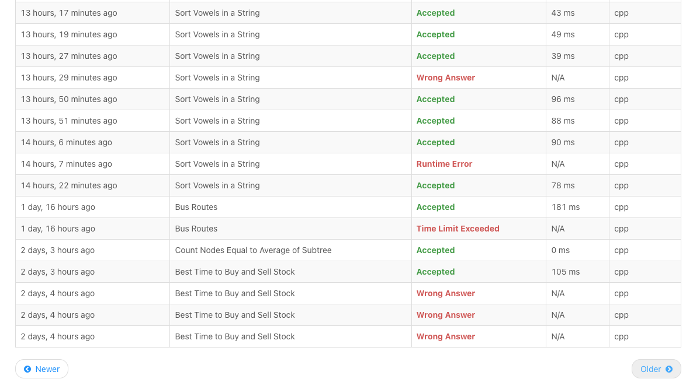

# LeetCode Toolkit: Solutions, Algorithms & Automated Downloader 🤖🧩

Welcome to the LeetCode Toolkit, my extensive solutions repository! As a senior software engineering student, this project captures my journey through the world of algorithmic challenges, focusing on enhancing my problem-solving skills. It features a variety of algorithmic domains, with a special emphasis on graph theory and its practical applications. Recently, I have started using this platform more actively. While I've included a selection of my work here, not everything is listed. For a complete view of my solutions and progress, please visit my full LeetCode profile at [Dor-sketch](https://leetcode.com/Dor-sketch/).

---


## NEW: LeetCode Solutions Downloader 📥

### Description

I've developed a Python script 🐍 to automate the downloading of accepted solutions from my LeetCode account: [LeetCode Downloader](download.py). This tool smartly navigates through submission history, identifying and storing accepted solutions for easy access and future reference.

### Features

- 🔄 Automated login and seamless navigation of LeetCode submissions.
- 📁 Well-organized directory structure for downloaded solutions.
- 📊 A comprehensive, up-to-date list of problems and solutions for quick referencing.

### How to Use

1. Install Selenium WebDriver and Python 3.x.
2. Clone the repository to your local machine.
3. Configure the script with your LeetCode credentials.
4. Execute the script to commence the automatic download of solutions.

### How it Works

Leveraging Selenium WebDriver, the script automates both the login process and the navigation on the LeetCode website. It meticulously parses submission history, and identifies accepted solutions, which are then downloaded and saved locally. The script also updates a comprehensive list of problems and solutions for quick reference.


_The submission history is parsed from the LeetCode website, and accepted solutions are downloaded and saved locally._

### Contribution to this Tool

Suggestions and contributions to enhance this downloader are welcome! Please feel free to fork the repository, make improvements, and submit a pull request.

## Graph Algorithms: An Overview 🌐🔍

Graph algorithms are a cornerstone of computer science, which I've delved into and implemented in this repository. These algorithms play a pivotal role in tackling complex problems across various network structures like social networks 🌍, computer networks 💻, and biological networks 🧬. Below is a succinct overview of some key graph algorithms and their real-world applications, demonstrated in [Graph.cpp](Algorithms/Graph.cpp):

- **Depth-First Search (DFS)** 🌳: This algorithm performs a deep traversal of a graph, exploring as far down each branch as possible before backtracking. It's instrumental in solving puzzles, analyzing networks, and in game playing algorithms.

- **Breadth-First Search (BFS)** 🌊: This algorithm broadly traverses a graph, visiting all neighbors at the current depth level before moving to nodes at the next depth level. Widely used in shortest path algorithms and social networking applications for finding connections within a certain number of steps.

- **Dijkstra's Algorithm** 🛣️: A renowned algorithm for finding the shortest path between nodes in a weighted graph. Essential in GPS systems for determining the shortest driving routes.

- **Bellman-Ford Algorithm** 🔍: Computes shortest paths from a single source vertex to all other vertices in a weighted graph, even handling negative weight edges.

- **Floyd-Warshall Algorithm** 🔗: A dynamic programming approach for finding shortest paths in a weighted graph with positive or negative edge weights, without negative cycles.

These algorithms are implemented in my repository, showcasing my grasp of graph theory and its practical applications in solving real-world problems.

---

### How to Use - GraphApp

1. Clone the repository to your local machine.
2. Navigate to the [Algorithms](Algorithms) directory.
3. Use the `make` command to compile the program.
4. Execute the program to run the algorithms with `./GraphApp`.

## Problems 🧩

You can find a comprehensive list of problems and solutions in [problems.md](problems.md).

## More Inside the Repository 📂

New solutions are added regularly via the [LeetCode Downloader](download.py). Old solutions are available in the [Hard](Hard), [Medium](Medium), and [Easy](Easy) directories like so:

```plaintext
.
├── Easy/
│   ├── Arrays/
│   ├── Strings/
│   └── ...
├── Medium/
│   ├── LinkedList/
│   ├── Trees/
│   └── ...
└── Hard/
    ├── Graphs/
    ├── Dynamic Programming/
    └── ...
```


## Contributing 💡

Although this is a personal repository primarily for self-learning, feedback or improvement suggestions are welcome. Please open an issue or submit a pull request.

## License ⚖️

This project is open source and available under the [MIT License](LICENSE).
